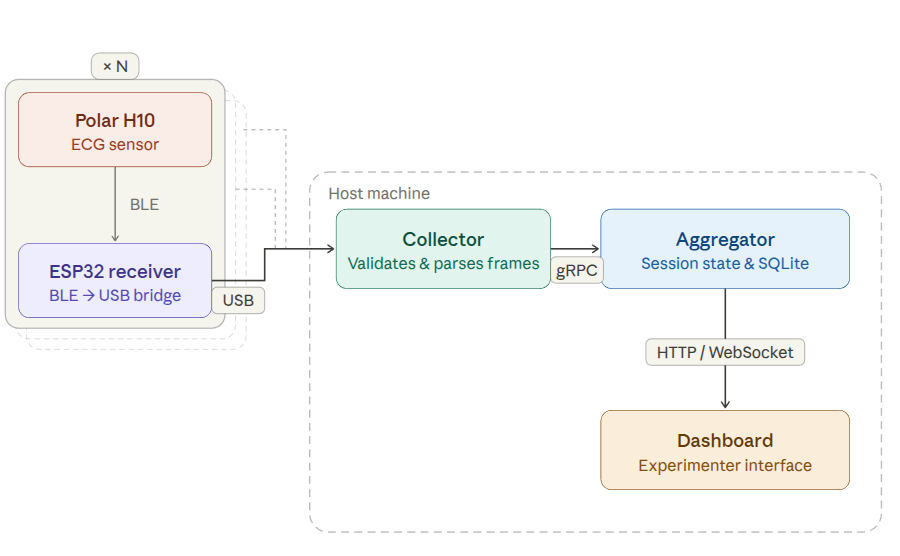

# ECG-Streaming

Multi-Device Real-Time ECG Aggregation & Web Visualization System

A distributed system for collecting, synchronizing, and visualizing ECG data from up to 20 Polar H10 chest straps with minimal latency.

## Architecture Overview

The system is split into two main modules that can run independently:



### Module Separation

**Collector (`ecg-collector`)**:
- Connects to Polar H10 devices via BLE directly, or via USB-connected ESP32 receivers acting as BLE bridges
- Manages multiple BLE adapters (hci0, hci1, hci2...)
- Timestamps samples at collection time
- Streams data to aggregator via gRPC

**Aggregator (`ecg-aggregator`)**:
- Receives data from multiple collectors
- Performs time alignment and synchronization
- Stores samples in SQLite database
- Serves real-time dashboard via WebSocket
- Provides REST API for metadata

**ESP32 firmware (`esp32/`)**:
- C firmware for ESP32-S3 receivers
- Connects to a Polar H10 via BLE and bridges data over USB CDC to the collector

**Simulator (`ecg-simulator`)**:
- Synthetic collector for testing without physical hardware
- Streams generated ECG data over gRPC, or replays recorded sessions from the database

## Quick Start

### Requirements

- Docker & Docker Compose
- Linux (required for BLE and USB device access)
- User in `dialout` and `bluetooth` groups for hardware access

### Setup

```bash
# 1. Copy and edit collector config
cp config/collector.yaml.example config/collector.yaml
nano config/collector.yaml  # add your device IDs

# 2. Build images
./stack.sh build

# 3. Start the stack
./stack.sh up-usb   # USB/ESP32 mode
./stack.sh up       # BLE mode

# 4. Open dashboard
open http://localhost:5173
```

See [docs/DOCKER_QUICKSTART.md](docs/DOCKER_QUICKSTART.md) for full setup instructions.

## Project Structure

```
ECG-Streaming/
├── packages/
│   ├── ecg-common/           # Shared models, gRPC protocol, logging
│   ├── ecg-collector/        # Collector (BLE and USB/ESP32 modes)
│   ├── ecg-aggregator/       # Aggregator, SQLite storage, WebSocket API
│   └── ecg-simulator/        # Synthetic collector for testing
├── config/                   # Runtime configuration
│   ├── aggregator.yaml
│   └── collector.yaml.example
├── esp32/                    # ESP32-S3 receiver firmware (C, ESP-IDF)
├── frontend/                 # SvelteKit web dashboard
├── docs/                     # Documentation
├── data/                     # SQLite database (bind-mounted in Docker)
├── dev.sh                    # Development tooling (fmt, lint, test)
└── stack.sh                  # Stack management (up, down, sim, pairing)
```

## Documentation

- [docs/DOCKER_QUICKSTART.md](docs/DOCKER_QUICKSTART.md) — getting started, running the stack
- [docs/ESP32_FIRMWARE.md](docs/ESP32_FIRMWARE.md) — ESP-IDF setup, building and flashing receiver firmware
- [docs/DEVELOPMENT.md](docs/DEVELOPMENT.md) — dev workflow, tooling
- [docs/QUICK_REFERENCE.md](docs/QUICK_REFERENCE.md) — command cheatsheet
- [docs/FRONTEND.md](docs/FRONTEND.md) — frontend development

## Features

### Collector Features
- Multi-device BLE connection (up to 20+ devices)
- Multiple BLE adapter support
- Concurrent device management
- gRPC streaming to aggregator
- Device status monitoring
- CLI tools (scan, auto-pair, signal)

### Aggregator Features
- gRPC server for receiving data
- Time synchronization engine
- SQLite database persistence
- WebSocket real-time streaming
- REST API for metadata
- Buffer management (30s window)
- Dashboard web interface

### Simulator (`ecg-simulator`)
A synthetic collector for testing without physical hardware. Streams mathematically generated ECG (and optionally accelerometer) data to the aggregator over the same gRPC interface as a real collector. Also supports replaying previously recorded sessions from the database.

```bash
./stack.sh sim                        # synthetic stream, 20 devices
./stack.sh sim --devices 5 --acc      # 5 devices with accelerometer
./stack.sh sim-sessions               # list recorded sessions
./stack.sh sim-replay 3 --speed 2.0   # replay session 3 at 2x speed
```

## API Reference

### REST Endpoints (Aggregator)

- `GET /` - Service information
- `GET /devices` - List all devices with sync status
- `GET /stats` - Synchronization and system statistics
- `GET /buffer/stats` - Buffer statistics
- `GET /buffer/latest` - Latest sample per device
- `WS /ws/ecg` - WebSocket for real-time ECG streaming

### CLI Tools

```bash
# Scan for BLE Polar devices
./stack.sh ble-scan

# Scan for connected ESP32 devices
./stack.sh usb-scan

# Auto-pair ESP32 devices with Polar sensors
./stack.sh auto-pair
```

## Configuration

See `config/collector.yaml.example` and `config/aggregator.yaml` for detailed configuration options:

**Collector:**
- `device_ids` - List of Polar H10 device IDs
- `aggregator.host` - Aggregator hostname/IP
- `aggregator.port` - Aggregator gRPC port (default: 50051)

**Aggregator:**
- `grpc.port` - gRPC server port (default: 50051)
- `api.port` - HTTP/WebSocket port (default: 7999)
- `storage.database_path` - SQLite database path

## System Requirements

- **Platform:** Linux
- **Runtime:** Docker & Docker Compose
- **Hardware:** BLE adapter (BLE mode) or USB ports (USB/ESP32 mode)
- **Development:** Python 3.14+, uv (see [docs/DEVELOPMENT.md](docs/DEVELOPMENT.md))

## Development

```bash
./dev.sh install   # install packages
./dev.sh check     # format + lint + type check
./dev.sh test      # run tests
```

See [docs/DEVELOPMENT.md](docs/DEVELOPMENT.md) for full details.
